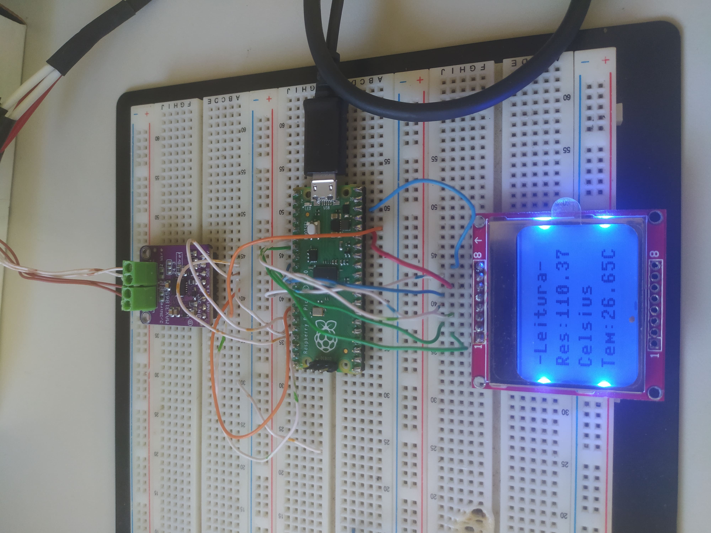
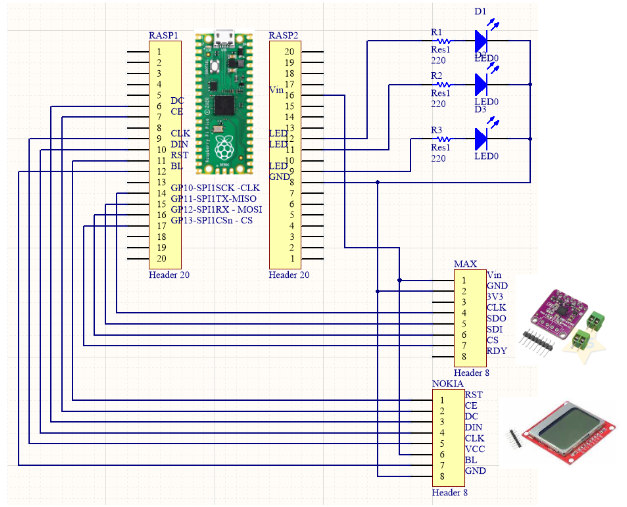
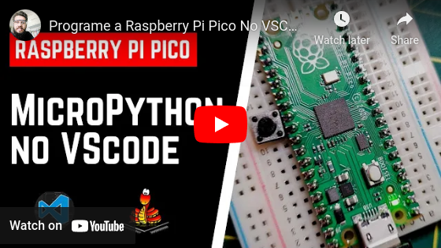

# MÓDULO DE TEMPERATURA

Projeto do sensor de temperatura, com o sensor do tipo *PT100* de 4 fios, um módulo *MAX31865* conversor do sinal para comunicação SPI com a placa *Raspberry Pi Pico* e com a visualização dos dados em um display *Nokia 5110*.

Foi utilizado o VSCode junto com o MicroPython para programar o microcontrolador. O arquivo `main.py` executa um loop, que realiza a leitura do sensor, e devolve um conjunto de parâmetros (como o valor bruto da resistência medida pelo *PT100* e a temperatura calculada). O arquivo `src/max31865.py` contém a conversão da leitura do valor lido pelo módulo para seu respectivo valor de temperatura associado, nele são definidos como parâmetro de entrada o número dos pinos GPIO utilizados.

Além disso, o projeto contém os arquivos Altium para criação da PCB de 2 faces do projeto e os arquivos Gerber e NC Drill para sua fabricação na pasta de "Outputs". Datasheets e documentos de referência também estão anexados no projeto.

<p align="center">
  
</p>

<p align="center">
  
</p>

## Informações Extras

- Para configurar um novo projeto de micropython no VSCode:
  - Pressione F1

  - Depois digite ou selecione:
  ```
  Pico-W-Go: Configure Project
  ```

  - Se você tiver problemas ao rodar os arquivos verifique o caminho relativo dos arquivos. Ex:
  ```
  from src.display_nokia import DisplayNokia
  ```

- Configuração do MicroPython no VSCode

<p align="center">
  <a href="https://youtu.be/XuYUaOdO07I" target="_blank"></a>
</p>
